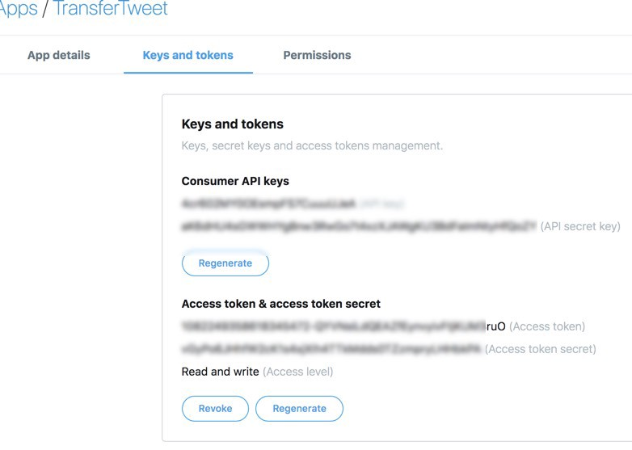
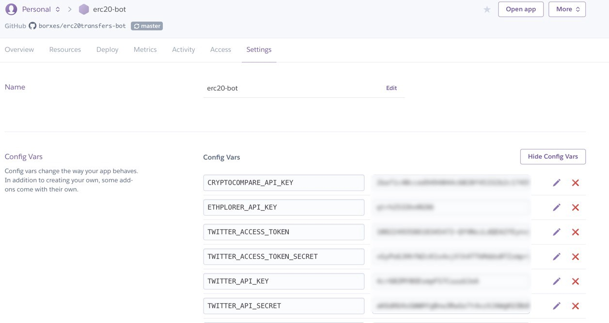

_This story was originally posted on [Hacker Noon](https://medium.com/hackernoon/building-a-twitter-bot-tracking-erc-20-token-transfers-with-node-js-heroku-and-crypto-apis-8cf618a3f287)_

How about a Twitter bot tweeting about significant ERC-20 token transfers? This information can be interesting for traders or to give real-time alerts about hacks and exit scams.

In this guide we will see how to track token transfers, how to tweet about them and how to host the bot on Heroku for free.

The bot runs at [@erc20events](https://twitter.com/erc20events) and the source code is available on [Github](https://github.com/borxes/erc20transfers-bot)

## Prerequisites

To follow this guide you will need a Twitter account for your bot, a free [Heroku](https://heroku.com) account and [node.js](https://nodejs.org/en/) on your development machine.

### Getting a Twitter developer account.

After you've created a fresh Twitter account, [apply for access](https://developer.twitter.com/en/apply-for-access.html) to the developers platform. Fill all the necessary details and wait for Twitter to approve you. It normally takes 24-48 hours. Once approved, [create a new app](https://developer.twitter.com/en/apps/create) in order to generate API keys and tokens.



## Starting with the project

We want to achieve the following:

- Continuously detect significant transfers of specific ERC-20 tokens.
- Connect to the Twitter API and tweet about these transfers
- Do it continuously.

## Detecting ERC-20 Token Transfers

For this project I've chosen 12 biggest ERC-20 tokens by market cap:

```javascript
const TOP_TOKENS = [
  {
    symbol: 'BNB',
    address: '0xB8c77482e45F1F44dE1745F52C74426C631bDD52',
    stable: false,
  },
```

Since the list was short, I just copypasted their contract address from [Etherscan](https://etherscan.io).

So how are we going to follow the transfers of these tokens? Each ERC-20 token transfer emits a Transfer() event.

The natural way would be to use the web3.js library to [subscribe](https://web3js.readthedocs.io/en/1.0/web3-eth-contract.html#contract-events) to these events and get notified e (through Infura's infrastructure, as we're not going to run a node) each time an event is emitted by a tracked ERC-20 contract, like so:

```javascript
const tokenContract = new web3.eth.Contract(erc20ABI, token.address);
const sub = tokenContract.events.Transfer(
  {
    fromBlock: 'latest',
  },
  (error, event) => {
    if (event) {
      tweetAboutEvent(event)
```

There is only one problem with this approach. The way these notifications work is that first we connect to Infura via a web socket:

```javascript
const web3 = new Web3(
  new Web3.providers.WebsocketProvider("wss://mainnet.infura.io/ws")
);
```

And in my experience, this connection is not the most reliable for getting frequent notifications. Since our bot is going to be hosted on Heroku (which restarts its dynos every day), we need a more reliable solution.

Another solution is the [API](https://github.com/EverexIO/Ethplorer/wiki/Ethplorer-API) provided by [Ethplorer.io](https://ethplorer.io). Specifically `getTokenHistory`. It returns an array of the last specified token's operations and even accepts a timestamp as a starting offset for operations - for example, we can ask only for the transfers that took place in the last minute.

Example: click [here](http://api.ethplorer.io/getTokenHistory/0xB8c77482e45F1F44dE1745F52C74426C631bDD52?apiKey=freekey&type=transfer&limit=5) to execute the following API call and see the five most recent BNB token transfers.

`http://api.ethplorer.io/getTokenHistory/0xB8c77482e45F1F44dE1745F52C74426C631bDD52?apiKey=freekey&type=transfer&limit=5`

## Calculating the value of ERC-20 token transfer

We have seen how to poll the Ethplorer API and get the latest ERC-20 token transfer per token contract address. But we are only interested in significant transfers, say transfers of tokens valued above \$25,000.

To calculate the value of a transfer, we need multiply the amount of tokens transferred by the token's current going rate.

Conveniently, Ethplorer's API returns a `tokenInfo` object in the response to `getTokenHistory`. This object contains the updated price information for the token. But there is a catch. For some interesting tokens, like REP (Augur) and HOT (Holo), price information is not returned.

To work around this issue, we can use the [CryptoCompare API](https://min-api.cryptocompare.com). The free tier gives you 100,000 calls per month, which is more than enough for retrieving our tokens' current price daily.

On initializing our bot, we will simply call CryptoCompare API's `/data/price` endpoint for each token in our token array and save the price that we get. We only need to do it once, because Heroku reboots the instance daily anyway, so the price will be updated every 24 hours.

```javascript
function getTokenInfo() {
  TOP_TOKENS.map((token, index) => {
    let cryptocomparePath = `${CRYPTOCOMPARE_API_URL}?fsym=${token.symbol}&tsyms=USD&?&api_key=${CRYPTOCOMPARE_KEY}`;
    axios
      .get(cryptocomparePath)
      .then(response => {
        token.rate = response.data.USD;
      })
      .catch(err => {
        console.log("Axios error", err);
      });
  });
}
```

Now that we have all token rates, we can easily calculate the values of each token transfer that we detect and tweet only about the significant ones.

## Continous transfer tracking with setInterval

Knowing how to ask about token transfers and calculate their value, we can know tie it all together.

```javascript
async function track(contractAddress, callback) {
  setInterval(() => {
    const oneMinuteAgo = Date.now() - 60000;
    axios
      .get(
        `${TOKEN_API_URL}/${contractAddress}?apiKey=${API_KEY}` +
          `&type=transfer&limit=${TRANSFERS_LIMIT}&timestamp=${oneMinuteAgo}`
      )
      .then(response => {
        response.data.operations.forEach(op => {
          callback(op);
        });
      })
      .catch(err => {
        console.log("Error", err);
      });
  }, API_THROTTLE_MS + randomInt(0, 10000));
}
```

This function does all the work of continuously tracking specific ERC-20 token transfers. We call the Ethplorer API and ask about all the transfers that happened in the last minute, then we send each received _operation_ to the provided callback.

The call to Ethplorer API is wrapped in `setInterval` so it will happen periodically. The interval is randomized, so that we don't bombard the API with call bursts (personal key is limited to 10 call a second).

## Filtering the important transfers

We have seen that for each detected token transfer, a callback is invoked. This callback function needs to calculate the value of a transfer and tweet about it only if the value exceeds our threshold.

```javascript
const THRESHOLD = 50000;
function handleEvent(event) {
  // convert the token value from web3.js into a normalized form
  function displayTokenValue(value, decimals = 18) {
    return Number((value / Math.pow(10, decimals)).toFixed(3));
  }

  function createEtherscanLink(transactionHash) {
    return `https://etherscan.io/tx/${transactionHash}`;
  }

  const txHash = event.transactionHash;
  if (txHash in events) {
    return;
  }

  const symbol = event.tokenInfo.symbol;
  const { from, to } = event;
  const amount = displayTokenValue(event.value, event.tokenInfo.decimals);
  const price = tokens.getRateBySymbol(symbol);
  const value = Number(price * amount).toFixed(2);
  const link = createEtherscanLink(txHash);
  if (value > THRESHOLD) {
    const output =
      `${amount} $${symbol} tokens transferred from ${from} to ` +
      `${to} Total Value $${value} URL: ${link}`;
    console.log(output);
    tweet.tweet(output);
  }
  events[txHash] = event;
}
```

Here we convert the amount of transferred tokens into a normalized form, taking into account the decimals that each token defines. Most ERC-20 tokens have 18 decimals (as Ethereum itself), but some are not: USDC stable coin defines only 6 and Zilliqa has 12, so we have to take this into account.

Then we multuply the transferred tokens amount by the price and get the value. If it exceed the threshold (currently $50000$), we construct a message string and tweet it.

We also save the transaction hash so that we won't tweet about the same transfer more than once.

## The simple act of tweeting

Please see this informative [article](https://codeburst.io/build-a-simple-twitter-bot-with-node-js-in-just-38-lines-of-code-ed92db9eb078) on how to connect to the Twitter API with node.js.

It succintly describes how to generate Twitter API keys and use them in our bot. Once we have those, we can simply tweet any message (and log it to the console too for a good measure)

```javascript
const options = {
  consumer_key: process.env.TWITTER_API_KEY,
  consumer_secret: process.env.TWITTER_API_SECRET,
  access_token_key: process.env.TWITTER_ACCESS_TOKEN,
  access_token_secret: process.env.TWITTER_ACCESS_TOKEN_SECRET,
};
const client = new require('twitter')(options);
function tweet(str) {
  client
    .post('statuses/update', { status: str })
    .then(function(tweet) {
      console.log(tweet);
    })
```

## Bringing it all together

```javascript
require("dotenv").config();
const tweet = require("./tweet");
const tracker = require("./track");
const tokens = require("./tokens");

tokens.config(); // retrieve rates from cryptocompare
tokens.topTokens.forEach(token => {
  let sub = tracker.track(token.address, handleEvent);
});
```

All we need to do is to read our API secrets from the .env file, initialize the tokens with their prices and start tracking them.

## Deploying the bot on Heroku

I've deployed the bot by signing up on [Heroku](https://heroku.com), creating a new app and connecting it to the bot's Github repo.

There are two modifications needed for Heroku:

1. Add a `Procfile` to the repo's root. This [file](https://github.com/borxes/erc20transfers-bot/blob/master/Procfile) lets Heroku know that this is a worker process and not a web application:

```
worker: node app.js
```

2. We cannot use the `dotenv` module anymore to read our API secrets from the .env file. Naturally, the .env file is not uploaded to Github and doesn't get deployed to Heroku. The simple solution is to manually define the secrets as config vars on Heroku's app settings page



## Results

The [bot](https://twitter.com/erc20events) has been running for a few days now, making 301 tweets and already has 10 followers!

There are a few things that can be done to improve it, such as make the tweets more visually attractive and filter out stablecoin tokens transfers.

Please let me know in the comments if you have any quesitons.
